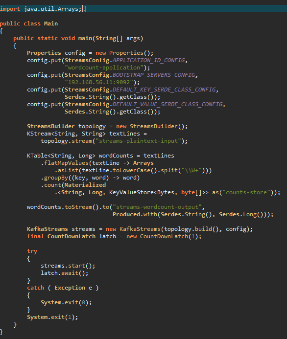

# eclipse-darkula
Java syntax highlighting for Eclipse Dark Skin similar to IntelliJ's Darkula Theme

Tested with Eclipse Neon

Usage:
* open {workspace}/.metadata/.plugins/org.eclipse.core.runtime/.settings/org.eclipse.jdt.ui.prefs
* replace all parameters starting with *semanticHighlighting* by the contents of org.eclipse.jdt.ui
